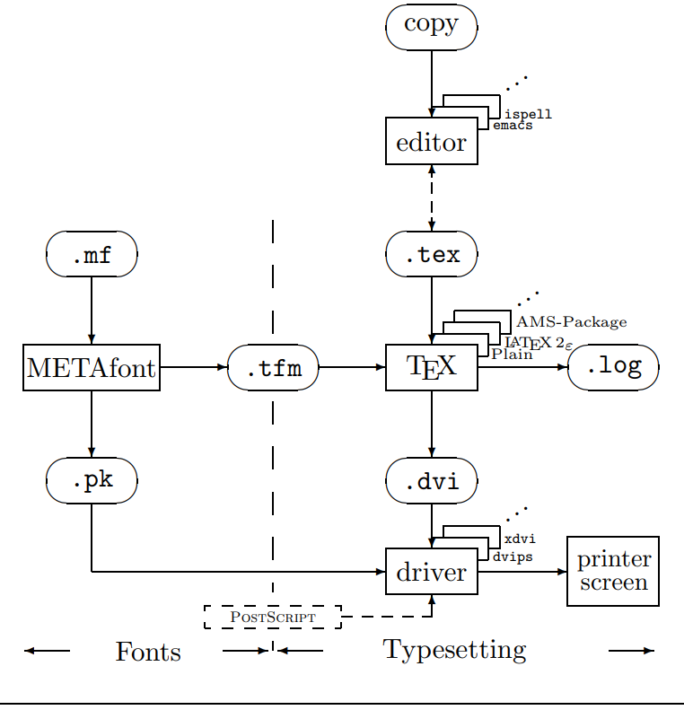

layout: true
  
<div class="my-footer"><span>
Dominando LaTeX - <a href="https://github.com/ElizaAlfaro">Elizabeth Alfaro-Espinoza</a>
</span></div>


---
class: middle
```{r setup, include=FALSE}
options(htmltools.dir.version = FALSE)

knitr::opts_chunk$set(echo = FALSE, fig.align = "center", message=FALSE, warning=FALSE, comment = "", cache = F, dev = "svg", fig.ext = "svg")
```

```{r include = FALSE}
library(knitr)
library(tidyverse)
library(widgetframe)
#library(checkdown)
```

```{r xaringanExtra, echo = FALSE}
# Add progress bar
xaringanExtra::use_progress_bar(color = "#0051BA", location = "top", height = "10px")

## Add color styles for code
xaringanExtra::use_extra_styles(
  hover_code_line = TRUE,         #<<
  mute_unhighlighted_code = TRUE  #<<
)

## add scribble... Press S
xaringanExtra::use_scribble()

## add overview... Press O
xaringanExtra::use_tile_view()

#Editar na hora
xaringanExtra::use_editable(expires = 1)

#Search icon
#xaringanExtra::use_search(show_icon = TRUE)

#Fit slides to screen
xaringanExtra::style_share_again(
  share_buttons = c("all")
)
#share again the slides
xaringanExtra::use_share_again()
xaringanExtra::style_share_again(
  share_buttons = c("twitter", "linkedin", "facebook")
)
```


# Elizabeth Alfaro-Espinoza
- Doutoranda no [Programa de Pós-Graduação em Bioinformática](http://www.pgbioinfo.icb.ufmg.br/) -  ICB/UFMG.

  - Bolsa CAPES - Processo nº 88887.517813/2020-00.
  
  - Membro do Laboratório de Universalização de Acesso - LUAR.
  
  
```{r, out.width="80%"}

```

- Anteriormente:

  - Graduada em Microbiología e Parasitología.

---
class: middle

<center><h1> TeX & LaTeX</h1></center>

.pull-left[
## Donald Knuth

```{r, fig.align='center', out.height="178px"}
knitr::include_graphics("https://upload.wikimedia.org/wikipedia/commons/thumb/2/26/Donald_Knuth_DSC00624.jpg/800px-Donald_Knuth_DSC00624.jpg")
```

- *"The Art of Computer Programming"* (1968, 3° Ed. 1977)

||||
|:-:|:-:|:-:|

]

.pull-right[

## Leslie Lamport

```{r, fig.align='center', out.height="178px"}
knitr::include_graphics("https://upload.wikimedia.org/wikipedia/commons/5/50/Leslie_Lamport.jpg")
```

- Desenvolvedor inicial do LaTeX (1974)

<center>
 
</center>

]
---
class: middle

<center><h1> TeX & LaTeX</h1></center>

.pull-left[
## TeX
- Sistema de formatação de código aberto
- Etimología: *"technē" ("tecnologia", "arte")*
- Pronúncia: *"Tequi"*

|<h3>$$T \tau$$|<h3>$$E \varepsilon$$|<h3>$$X \chi$$|
|:-:|:-:|:-:|

## LaTeX
- Conjunto de macros dentro do TeX
- *Lamport TeX* ---> LaTeX
- Pronúncia: *"Latequi", "Leitequi"*
]

.pull-right[

```{r, out.width="90%", fig.cap="TeX e LaTeX2e trabalhando juntos. Fonte: Oetiker et al. (2002)"}

```

]
---
class: middle
 
# Motivação

.pull-left[

<center></center>

`r emo::ji("pushpin")` Projetos

`r emo::ji("pushpin")` TCC, Dissertação, Tese

`r emo::ji("pushpin")` Relatório de pesquisa

`r emo::ji("pushpin")` Apresentações

`r emo::ji("pushpin")` CV

`r emo::ji("pushpin")` **Artigos** 
]

.pull-right[

<center></center>

`r emo::ji("pushpin")` Relatórios

`r emo::ji("pushpin")` Apresentações

`r emo::ji("pushpin")` CV

`r emo::ji("pushpin")` **Artigos**
<br><br><br><br><br>
*Fonte: <a href="https://www.flaticon.com/free-icons/share" title="share icons">Freepik - Flaticon</a>. Licença CC Atrib.*
]

---
class: middle

.pull-left[

# Vantagens

- `r emo::ji("point_right")` Templates prontos

- `r emo::ji("point_right")` Gera equações formatadas

- `r emo::ji("point_right")` Aprender comandos intuitivos*

- `r emo::ji("point_right")` Organização automática: 
  - Figuras & Tabelas
  - Referencias & Notas de rodapé
  
- `r emo::ji("point_right")` Muitos pacotes complementares

- `r emo::ji("point_right")` Não há incompatibilidade de versões

- `r emo::ji("point_right")` Documentos pequenos e rápidos

- `r emo::ji("point_right")` Pode comentar
]

.pull-right[

# Disvantagens

- Taxa de aprendizado:

```{r, out.width="90%", fig.cap="LaTeX versus Word. Fonte: Marko Pinteric. Todos os direitos reservados."}
knitr::include_graphics("http://www.johndcook.com/wordvslatex.gif")
```

]

---
class: middle

# Estrutura

```
\documentclass{article}   % Classe do arquivo

\usepackage[utf8]{inputenc}   % Pacotes utilizados

\title{Meu primeiro documento en \LaTeX}
\author{Elizabeth Espinoza}

\begin{document}    % Iniciar o texto
\maketitle


\end{document}    % Acabou o texto
```

---
class: middle

# Distribuições TeX

<center><h4>--> Coleções de pacotes e programas que permitem a compilação de arquivos .tex em documentos legíveis.</h4></center><br>


|SO|||||
|:--:|:--:|:--:|:--:|:--:|
||`r emo::ji("white_check_mark")`||`r emo::ji("white_check_mark")`|`r emo::ji("white_check_mark")`|
||||`r emo::ji("white_check_mark")`|`r emo::ji("white_check_mark")`|
|||`r emo::ji("white_check_mark")`|`r emo::ji("white_check_mark")`|`r emo::ji("white_check_mark")`|

---
class: middle

# IDEs

<center><h4>--> Softwares que auxiliam na edição e compilação dos arquivos .tex</h4></center><br>

|||||||
|:-:|:-:|:-:|:-:|:-:|:-:|
|<h3>TeXstudio</h3>|<h3>TeXmaker</h3>|<h3>Kile</h3>|<h3>LyX</h3>|<h3>TextWorks</h3>|<h3>Overleaf</h3>|

---
class: middle


.left-column[ 

```{r, out.width="100%", fig.align='right'}
knitr::include_graphics("https://images.ctfassets.net/nrgyaltdicpt/6gsvc5Ogjmu04I4Miu0uGg/cb1d4391717d2ab8d5e42ede6fb0eef1/overleaf_wide_colour_light_bg.png")
```

### [www.overleaf.com/](https://www.overleaf.com/)

- Arquivos salvos na nuvem

- Colaborativo

- Histórico dos arquivos

- Nenhuma instalação

- Diversos templates
]

.right-column[ 
<br><br><br><br><br>
```{r, out.width="94%", fig.align='right'}
knitr::include_graphics("https://sharelatex-wiki-cdn-671420.c.cdn77.org/learn-scripts/images/f/f0/V2-resize-panels.gif")
```
]


---
class: middle
# Vamos aprender praticando!

## Dinâmica A

### - Fazer o cadastro
### - Clicar no botão superior esquerdo "New Project" --> "Blank Project"
<br>
## Dica:

### - Compilar no Overleaf -- `Control+Enter`

---
class: middle

# Qué vamos a ver?

.pull-left[

- **Classe de arquivos**

- **Pacotes essenciais**

  - `babel`
  
  - `inputenc`
  
  - `graphicx`
  
  - `hyperref`
  
  - `amsmath`
  
  - `subcaption`
]

.pull-right[

- **Comandos básicos**

  - `title`, `author`, `date`
  
  - Sumário (`tableofcontents`)
  
  - `section`, `subsection`, `subsubsection`
  
  - Estilo (`bf`, `it`)
  
  - Links (`url`)
  
  - Listas (itemize, enumerate)
  
  - Quebra de linha
]

---

class: middle

# Caso real

- Queremos submeter [este artigo](https://docs.google.com/document/d/12-kL14TGEO1fP1czhQwS0pHttGUdJ3kG0YmsdFUL90A/edit?usp=sharing) para o BSB2022.

|<h4>"The format to be used is “Lecture Notes in Computer Science” (LNCS). Authors should consult [Springer’s authors’ guidelines](https://www.springer.com/authors/manuscript+guidelines?SGWID=0-40162-6-795324-0) and use [their proceedings templates](https://www.springer.com/gp/computer-science/lncs/conference-proceedings-guidelines), either for LaTeX or for Word, for the preparation of their papers. The actual submission must be in PDF format (maximum 20 Mb). LaTex or Word versions (on which the PDF must be based) will be required later, for accepted papers, for inclusion in the LNBI proceedings. BSB encourages authors to include their ORCIDs in their papers."</h4>|
|:-:|

- Temos nossa de conta em Overleaf, temos o artigo e o [template](https://www.overleaf.com/latex/templates/springer-lecture-notes-in-computer-science/kzwwpvhwnvfj#.WuA4JS5uZpi) em LaTeX.

- Vamos lá!

---

class: middle

# Qué vamos a ver?

- Equações 

  - O que acha do [codecogs](https://www.codecogs.com/eqnedit.php)?

- Referências

  - [Scholar](https://scholar.google.com)
  
  - [Crossref](https://computeel.org/computeel/blog/2019/01/17/Bibtex.html)
  
- Figuras

- Tabelas 
  
  - O que acha do [Tables Generator](https://www.tablesgenerator.com/)?
---
class: middle

# Onde procurar ajuda?

.pull-left[
## Sítios Q&A

|<h4>[StackOverflow](https://stackoverflow.com/)</h4>|<h4>[TeX - LaTeX Stack Exchange](https://www.latex-project.org/help/links/#question-and-answer-websites:~:text=TeX%20%2D%20LaTeX%20Stack%20Exchange)</h4>|<h4>[LaTeX Community](http://www.latex-community.org/)</h4>|
|:-:|:-:|:-:|
|||<h5></h5>|

]

.pull-right[


## Tutoriais

|<h4>[Learn LaTeX](https://www.learnlatex.org/pt/)</h4>|<h4>[Learn LaTeX in 30 minutes](https://www.overleaf.com/learn/latex/Learn_LaTeX_in_30_minutes)</h4>|
|:-:|:-:|:-:|
||<h5></h5>|
]
---
class: middle

## Documentação
- [Comprehensive TEX Archive Network (CTAN)](https://ctan.org/)

- [TeXdoc Online](https://texdoc.org/)

- [The LaTeX Project](https://www.latex-project.org/help/)


---

class: middle

# Muito obrigada!
.pull-left[

```{r, out.width="90%"}
knitr::include_graphics("https://pbs.twimg.com/media/FMAytwnX0AYLBY_.png")
```
]


.pull-right[
**Referências**:
- Santos, Reginaldo. [Introdução ao LaTeX](http://each.uspnet.usp.br/sarajane/wp-content/uploads/2016/10/manual-latex-3.pdf). UFMG, 2012

- Oetiker et al. [Introdução ao LaTeX2e em 105 minutos](https://www.ime.usp.br/~reverbel/mac212-02/material/lshortBR.pdf). Lshort (2002).

#####Feito com `r emo::ji("blue_heart")` usando [Xaringan](https://github.com/yihui/xaringan) e [XaringanExtra](https://github.com/gadenbuie/xaringanExtra).
]

**Contato**:
- Email: <a href="mailto:elizaespinoza@ufmg.br">elizaespinoza@ufmg.br</a>
- Github: <a href="https://github.com/ElizaAlfaro">@elizaAlfaro</a>
- Twitter: <a href="http://twitter.com/elizabioinfo">@elizabioinfo</a>

xaringan::inf_mr()

---
class: middle


```{r embed-xaringan, echo=FALSE}
xaringanExtra::embed_xaringan(url = "https://dominandolatex.netlify.app/", ratio = "16:9",
  max_width = 610)
```

<center/><h3>[https://bit.ly/latex-cvbioinfo](https://bit.ly/latex-cvbioinfo) </h3>


